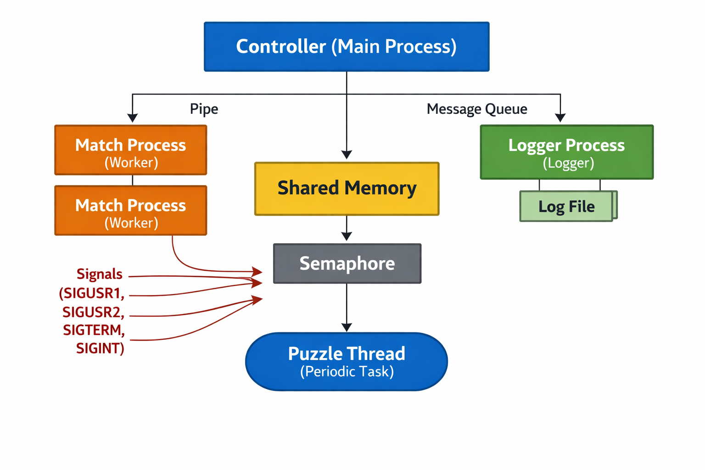

# Linux Chess Academy Simulation (System Calls & IPC Project)

## Overview

This project implements a **multi-process, multi-threaded simulation system** using Linux system calls and POSIX APIs.

Although modeled as a *Chess Academy*, the system is designed as a **distributed training and performance monitoring system**, where multiple worker processes execute tasks concurrently and a central controller manages execution, logging, and performance evaluation.

The project demonstrates practical usage of:

* Process management
* Inter-process communication (IPC)
* Synchronization
* Signal handling
* File operations

---

## Objective

To design a simulation-based system that integrates Linux system calls and IPC mechanisms in a realistic and structured manner, demonstrating concurrency, coordination, and system-level programming.

---

## System Description

The system simulates:

* Multiple **players (agents)** participating in matches
* A **controller process** managing execution
* A **logger process** recording results
* A **puzzle evaluation system** running periodically using threads
* A **leaderboard system** tracking performance

The system is **event-driven**, controlled via signals.

---

## Key Features

* Multi-process architecture using `fork()` and `execv()`
* Multi-threading using POSIX threads (`pthread`)
* Multiple IPC mechanisms:

  * Pipe
  * Message Queue
  * Shared Memory
  * Semaphore
* Signal-based system control
* Real-time logging system
* Periodic puzzle evaluation
* Leaderboard tracking player performance

---

## Architecture



---

## Workflow

1. System starts in idle mode
2. Signals control execution:

   * Start matches
   * Run puzzle sessions
   * Display leaderboard
   * Stop system
3. Match processes:

   * Simulate execution with random delays
   * Send results via pipe
4. Controller:

   * Updates leaderboard (shared memory)
   * Sends logs via message queue
5. Logger:

   * Writes results into `log.txt`
6. Puzzle thread:

   * Periodically updates puzzle performance

---

## Signals Used

| Signal  | Function              |
| ------- | --------------------- |
| SIGUSR1 | Start match execution |
| SIGUSR2 | Start puzzle session  |
| SIGTERM | Display leaderboard   |
| SIGINT  | Stop system           |

---

## IPC Mechanisms Used

| Mechanism     | Purpose                           |
| ------------- | --------------------------------- |
| Pipe          | Match → Controller communication  |
| Message Queue | Controller → Logger communication |
| Shared Memory | Stores leaderboard data           |
| Semaphore     | Synchronizes shared data access   |

---

## Threads & Synchronization

* `pthread` used for puzzle session execution
* Semaphore used to prevent race conditions between:

  * processes
  * threads

---

## File Handling

| File          | Purpose                        |
| ------------- | ------------------------------ |
| `log.txt`     | Stores match results           |
| `players.txt` | Stores final player statistics |

System calls used:

* `open()`
* `read()`
* `write()`
* `lseek()`
* `close()`

---

## Leaderboard Metrics

Each player has:

* Matches Played
* Matches Won
* Puzzles Correct
* Puzzles Wrong

---

## How to Run

### 1. Compile

```bash
make
```

### 2. Run

```bash
make run
```

---

## Control via Signals (Use another terminal)

### Get PID:

```bash
pgrep main
```

### Start Matches:

```bash
kill -SIGUSR1 <pid>
```

### Start Puzzle Session:

```bash
kill -SIGUSR2 <pid>
```

### Show Leaderboard:

```bash
kill -SIGTERM <pid>
```

### Stop System:

```bash
kill -SIGINT <pid>
```

---

## Sample Output

```
Match 123 started (3 sec)
Match 124 started (5 sec)

Match 123 finished -> Winner Player 4
Controller: Player 4 won

--- Puzzle Session ---
Puzzle session done

--- Leaderboard ---
Player 4 -> Played:1 Won:1 Correct:3 Wrong:2
```

---

## Challenges Faced

* Managing synchronization between processes and threads
* Handling concurrent output and buffering issues
* Designing signal-driven control flow
* Ensuring clean process termination

---

## Conclusion

This project demonstrates a comprehensive implementation of Linux system programming concepts through a realistic simulation. It integrates multiple IPC mechanisms, process control, threading, and signal handling into a cohesive system.

---

## Future Scope

* Add GUI for visualization
* Extend to network-based distributed system
* Implement real-time ranking algorithms
